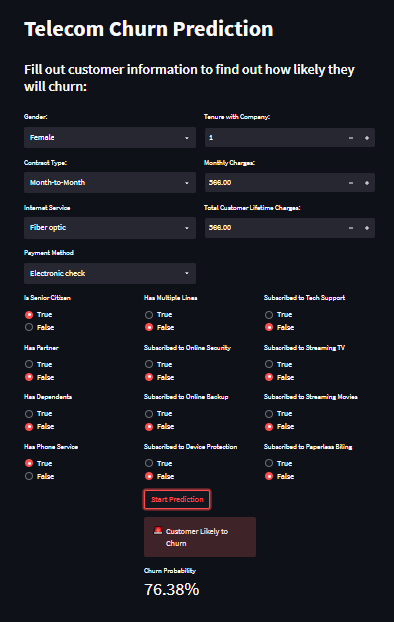
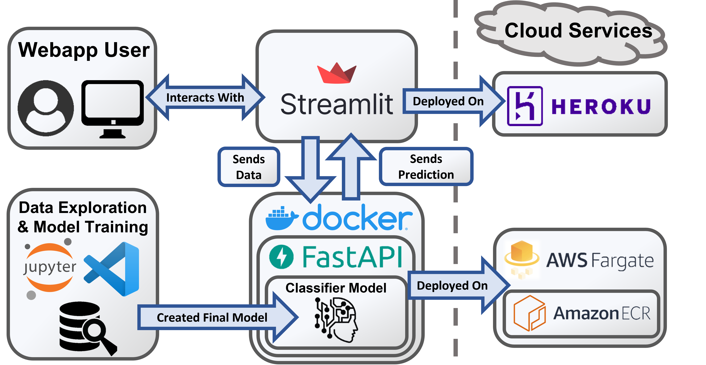
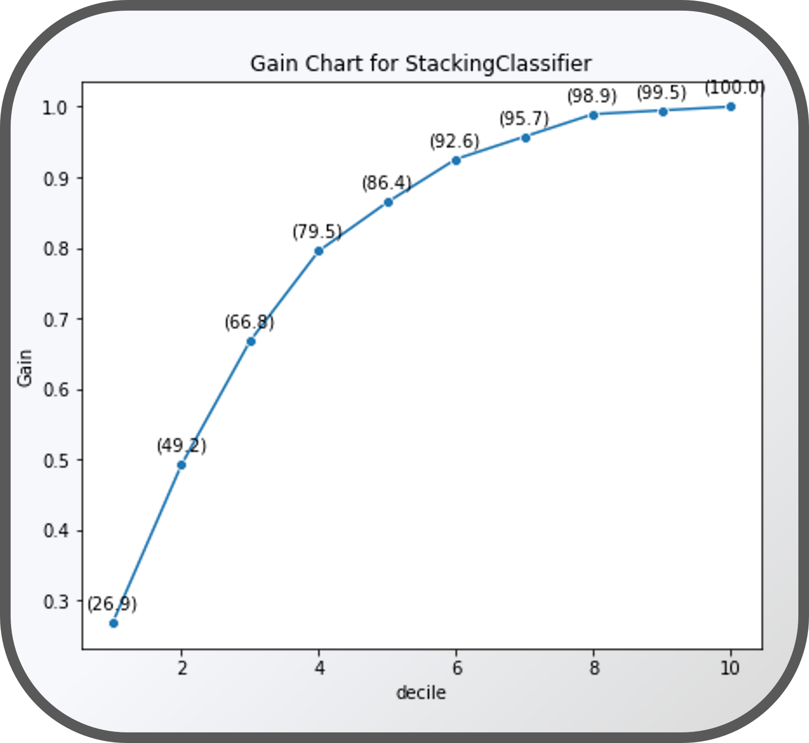
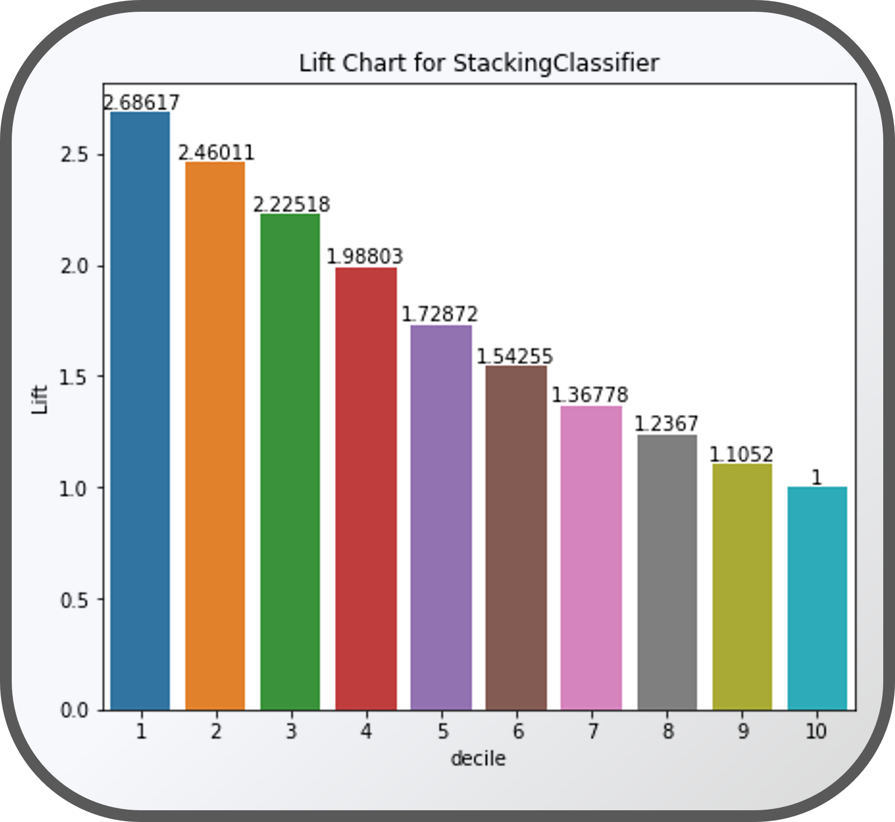

# Telecom Customer Churn Prediction

Due to the interchangeability of telecommunication services, the industry sees monopolistic competition with each industry player vying hard to not only gain subscribers, but retain existing ones as well. Hence, many telecom companies constantly create and update churn prediction models to predict whether a customer would leave their services for a competitor. A telecom provider can then offer incentives to a customer with high churn probability, in so preventing them from leaving for a competitor.

View Exploratory Data Analysis Notebook: [Here](https://github.com/Jeff-ChenFan-Wang/TelecomChurnAnalysis/blob/master/EDA.ipynb). <br>
View Model Building Notebook: [Here](https://github.com/Jeff-ChenFan-Wang/TelecomChurnAnalysis/blob/master/Model.ipynb).

## Description
### View Deployed Webapp at: https://jeffwang-telecomchurn.herokuapp.com/<br> 
<br>
<br>

This project aims to predict a customer's churn probability for a U.S based telecommunication company, the data of which was originally provided by an IBM thinktank. 


## Techstack
<br>

Project Pipeline:
 1. The user loads the streamlit webapp then inputs customer info
 2. Streamlit sends HTTP Post request to FastAPI Endpoint
 3. FastAPI parses input and uses trained classifier model to predict whether the customer would churn
 4. Prediction result is sent back to user interface

**Techstack Setup** <br>
Python Version: 3.10 <br>
Packages: `Scikit-Learn, XGBoost, LightGBM, Pandas, Numpy, FastAPI, Streamlit, Docker` <br>
Cloud Services: `Heroku, AWS Fargate, AWS ECR`<br>
 - Model is trained on local machine with the final classifier and data processing pipeline exported as pickle files
    - The final classifier is an ensemble Stacking Classifier combining 5 different models:
        - Logistic Regression (Ridge-Lasso)
        - K-Nearest Neighbor Classifier
        - Random Forest Classifier
        - XGBoost
        - LightGBM
 - FastAPI loads classifier and pipeline pickle files, then exposes an endpoint for prediction
 - FastAPI is then built into a Docker image
    - FastAPI Docker image is pushed to AWS ECR
    - FastAPI Docker container is deployed on AWS Fargate cluster by ECS
 - Streamlit frontend is deployed on Heroku directly

I'll admit this techstack is a little overengineered since I wanted practice with tools such as Docker and FastAPI (later once the AWS bill starts ramping up I may simplify it down to the barebones).<br>

## Model Results for Business Stakeholders
Most of the time metrics such as AUROC, F1-Scores, Average Precision etc. are too complicated to explain to personnel within the company without statistical backgrounds (These metrics however are still included in the Model training notebook). Hence most business stakeholders prefer to use metrics such as gain and lift instead, which we see below:<br>
<br>
 - The gain chart indicates the percentage of customers that will churn correctly identified by the model at each decile of customers. 
    - This gain chart therefore indicates that by just offering 20% of all our customers a special promotion for staying, we may be able to reduce churn rates by nearly 50%. <br>

 <br>
 - The lift chart indicates how many times more customers that will churn are correctly identified by our model at each decile of data than if we just randomly sample that decile of data.
    - This lift chart therefore indicates that if we can only select 10% of all customers, our model can correctly identify ≈2.7 times more customers that will churn than just randomly choosing the 10%. <br>

# Reproducing Results
## Environment
The environment in which the Exploratory Data Analysis (EDA) and Model creation and testing can be cloned for reproducibility. The steps to do so are as follows:
1. Download the Anaconda distribution 
2. Clone the repository from Github
3. Run the below command in an anaconda terminal to clone the environment from the provided environment.yml in the repository
    ```
    "conda env create -f environment.yml"
    ```


## Dataset 
- Raw data can be downloaded from: https://www.kaggle.com/datasets/blastchar/telco-customer-churn?resource=download
- The zip file of the data is contained within the repository
- To clean the data into a state used for EDA and model building, activate the environment and preprocessing script with the below commands
    ```
    activate telecomChurn
    python preprocess_zip.py
    ```
